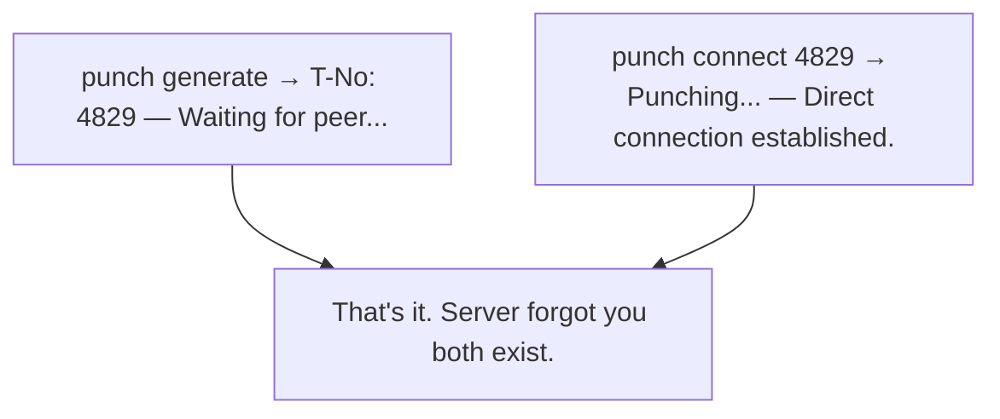
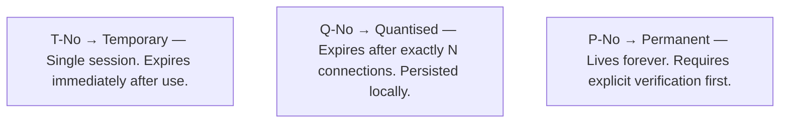
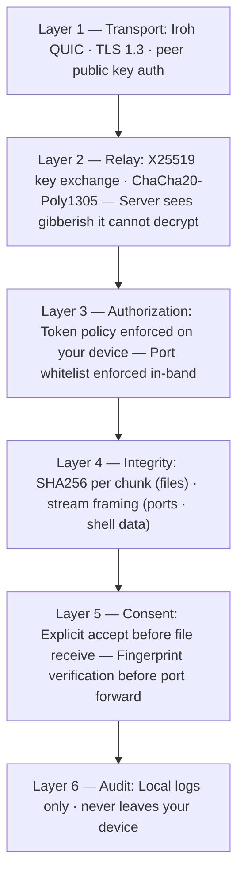
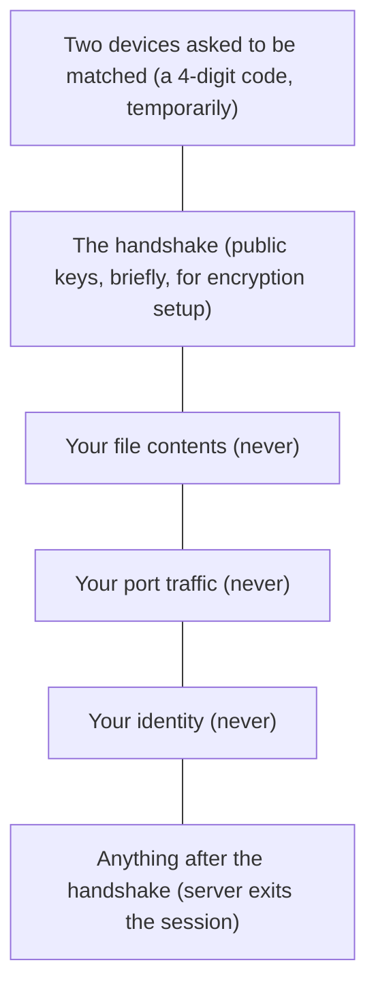
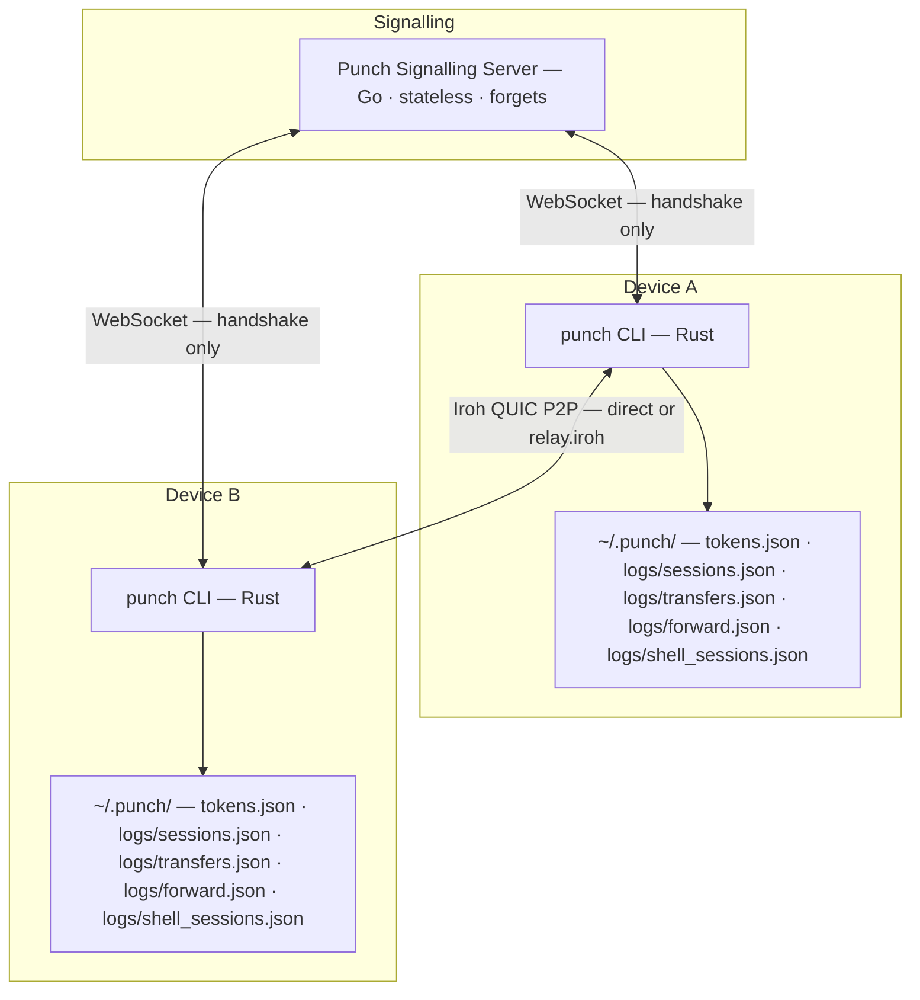
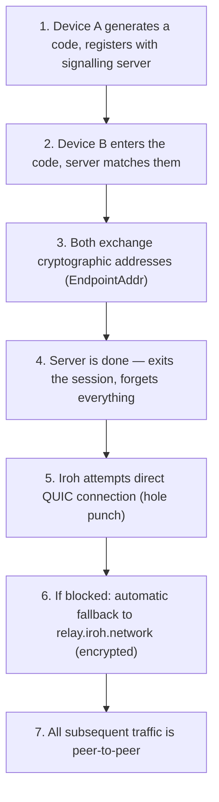

<div align="center">

```
██████╗ ██╗   ██╗███╗   ██╗ ██████╗██╗  ██╗
██╔══██╗██║   ██║████╗  ██║██╔════╝██║  ██║
██████╔╝██║   ██║██╔██╗ ██║██║     ███████║
██╔═══╝ ██║   ██║██║╚██╗██║██║     ██╔══██║
██║     ╚██████╔╝██║ ╚████║╚██████╗██║  ██║
╚═╝      ╚═════╝ ╚═╝  ╚═══╝ ╚═════╝╚═╝  ╚═╝
```

### **Punches through networks. Connects two devices. Gets out of the way.**

*No VPN. No account. No cloud middleman. No persistent overlay. No bullshit.*

<br/>

[](LICENSE)
[](https://www.rust-lang.org/)
[](https://golang.org/)
[]()
[]()

<br/>

**[Install](#install) · [Quick Start](#quick-start) · [All Commands](#all-commands) · [How it works](#how-it-works) · [Self-hosting](#self-hosting) · [Roadmap](#roadmap)**

<br/>

</div>

---

## The Problem

You want to share your screen, send a file, forward a port, or access your home server from anywhere. Here's what the world offers you:

| Tool | What it actually means |
|------|----------------------|
| **ngrok** | Your traffic routes through their servers. They can read it. |
| **Tailscale** | Create an account → install → login → get assigned a VPN IP → now you're in a persistent mesh. Just to share one port. |
| **Port forwarding** | Requires router access, exposes your real IP, breaks when your ISP changes it. |
| **SSH tunnels** | Need a publicly reachable server to bounce through. |

**None of these do the simple thing:** connect Device A to Device B, directly, temporarily, and then disappear.

Punch does the simple thing.

---

## What Punch Actually Does



One code. Two devices. Done.

---

## What's Inside

| Feature | Command | Status | Transport |
|---------|---------|--------|-----------|
| P2P connection | `punch generate` / `punch connect` | **Shipped** | QUIC + relay |
| Encrypted relay fallback | automatic | **Shipped** | X25519 + ChaCha20 |
| Token access control | T-No · Q-No · P-No | **Shipped** | — |
| File transfer | `punch send` / `punch receive` | **Shipped** | Iroh QUIC |
| Port forwarding | `punch forward` | **Shipped** | Iroh QUIC |
| Remote terminal | `punch shell host` / `punch shell connect` | **Shipped** | Iroh QUIC + PTY (portable-pty, crossterm) |
| Local dashboard | `punch dashboard` | Planned (v0.7) | — |
| Developer library | `punch-core` crate | Planned (v0.8) | — |

---

## Install

### Download (no Rust required)

Grab the binary for your platform from [**Releases →**](https://github.com/MannanSaood/Punch/releases)

| Platform | Binary |
|----------|--------|
| Windows (x64) | `punch-windows-x86_64.exe` |
| Linux (x64) | `punch-linux-x86_64` |
| macOS (Intel) | `punch-macos-x86_64` |
| macOS (Apple Silicon) | `punch-macos-arm64` |

**Windows — add to PATH:**
```powershell
# Move punch.exe somewhere permanent, then:
$env:PATH += ";C:\path\to\punch"
```

**Linux / macOS:**
```bash
chmod +x punch-linux-x86_64
sudo mv punch-linux-x86_64 /usr/local/bin/punch
```

### Build from Source
```bash
git clone https://github.com/MannanSaood/Punch.git
cd Punch/core
cargo build --release
# Binary: target/release/punch
```

> **Note:** Punch works best on WiFi. Mobile and corporate networks fall back to encrypted relay automatically.

---

## Quick Start

### Connect two devices
```bash
# Device A
punch generate
# T-No: 4829 — share this with Device B

# Device B
punch connect 4829
# Punched! Direct connection established.
```

### Send a file (with safety checks)
```bash
# Device A
punch send invoice.pdf
# T-No: 6241 — share this with Device B

# Device B
punch receive 6241 --dest ~/Downloads
# Shows: filename, size, risk level, fingerprint
# Accept? (yes/no): yes
# Verified. Saved to ~/Downloads/invoice.pdf
```

### Send a large file (resumable)
```bash
# Device A — generate a reusable token
punch generate --uses 5
# Q-No: 7731

punch send movie.mkv
# 310 chunks × 4MB | 4 parallel Iroh QUIC streams

# Device B
punch receive 1234 --dest ~/Downloads
# Drop mid-transfer? Just run the same command again.
# Resuming: 187/310 chunks already verified
```

### Forward a port (Jellyfin, dev server, anything)
```bash
# Device A — expose local Jellyfin
punch forward expose 8096

# T-No: 9182 — share this with Device B
# Fingerprint: 3a7f-12bc-88de

# Device B
punch forward connect 9182
# Verify fingerprint: 3a7f-12bc-88de
# Connect? (yes/no): yes
# TCP: localhost:54231 → remote:8096
# Open http://localhost:54231 in your browser
```

### Forward TCP + UDP (game servers, VoIP)
```bash
punch forward expose 25565 --udp   # Minecraft
punch forward connect <code> --udp
```

### Remote shell (host approves, full Iroh QUIC link)
```bash
# Device B — machine that runs the shell (prints a code)
punch shell host --server ws://localhost:8080
# Optional: punch shell host --uses 5   or   --permanent

# Device A — connect with the code / verify fingerprint
punch shell connect 4829 --server ws://localhost:8080
# Host must answer consent prompts; then you get an interactive terminal (e.g. cmd.exe / $SHELL).
# Host: Ctrl+K kills the session; client: Ctrl+C exits.
```

### Access your home server — every time
```bash
# Home server — once
punch generate --uses 100
# Q-No: 7731
punch verify 7731

# Home server — every reconnect (no new token generated)
punch listen 7731

# Your laptop — anywhere
punch connect 7731
```

---

## Token System

The token type **is** the security policy. No settings menu, no dashboards, no OAuth.



```bash
punch generate                  # T-No: one shot
punch generate --uses 10        # Q-No: 10 connections, then gone
punch generate --permanent      # P-No: verify before first use

punch listen <code>             # reconnect on existing token, no use consumed
punch tokens                    # see all active tokens
punch revoke <code>             # kill a token immediately
punch verify <code>             # activate a P-No token
```

**Enforcement is on your device.** The server is zero-knowledge — it never sees or stores tokens.

---

## File Transfer

Files go **directly peer to peer via Iroh QUIC**. The signalling server never sees a byte of your data.

```
< 100 MB   →  1 MB  chunks  (~100 chunks)
100 MB–1 GB →  4 MB  chunks  (~250 chunks)
1 GB–10 GB  → 16 MB  chunks  (~625 chunks)
> 10 GB     → 64 MB  chunks  (manageable state)
```

**Every transfer has:**
- 4 parallel QUIC streams (IDM-style)
- SHA256 per chunk + whole file
- Resumable — `.punch_partial` survives restarts and crashes
- Idempotent chunks — ACK-lost-after-completion is handled correctly
- Connection drops vs data corruption treated differently

**Every receive has:**
- Consent prompt before any data flows
- Risk classification: high-risk executables, archives with possible payloads, media and documents
- Session fingerprint for verbal verification with sender
- Acceptance always logged to `~/.punch/logs/transfers.json`

```bash
punch send video.mp4
punch send setup.exe              # receiver sees HIGH RISK warning

punch receive 1234                # saves to current directory
punch receive 1234 --dest ~/Downloads
punch receive 1234 -d "C:\Users\UserName\Downloads"
```

---

## Port Forwarding

Forward any TCP or UDP port directly between two devices. No relay bottleneck — traffic goes peer to peer over Iroh QUIC.

**Works for:**
- Jellyfin / Plex media servers
- Vite / webpack dev servers (handles both `127.0.0.1` and `[::1]`)
- SSH (port 22)
- Databases (Postgres 5432, MySQL 3306)
- Minecraft and game servers
- Anything that listens on a port

```bash
# Expose (Device A — where the service runs)
punch forward expose 8096                    # TCP only
punch forward expose 25565 --udp            # TCP + UDP
punch forward expose 3000 --uses 5          # Q-No: 5 sessions
punch forward expose 22 --permanent         # P-No: always accessible

# Connect (Device B — where you want to access it)
punch forward connect <code>                # auto-assigns local port
punch forward connect <code> --local 8096  # specific local port
punch forward connect <code> --udp         # enable UDP
```

**Security per session:**
- Iroh QUIC with peer public key authentication (no MITM possible)
- Port whitelist enforced via in-band handshake — only the agreed port, nothing else
- Session fingerprint for verbal verification
- Max 50 concurrent streams (DoS protection)
- Full audit log at `~/.punch/logs/forward.json`

---

## Security Model



**What the server sees:**



---

## How It Works



**Connection flow:**



---

## Self-Hosting

The signalling server is tiny (stateless Go binary) and easy to self-host. You don't have to trust anyone's infrastructure.

```bash
# Docker (recommended)
docker run -p 8080:8080 \
  -e PUNCH_MAX_SESSIONS=1000 \
  user/punch-server

# From source
cd server && go run cmd/main.go

# Point CLI at your server
punch generate --server ws://your-server.com:8080
punch connect 1234 --server ws://your-server.com:8080
punch forward expose 8096 --server wss://your-server.com
punch shell host --server ws://your-server.com:8080
punch shell connect <code> --server ws://your-server.com:8080
```

**Environment variables:**

| Variable | Default | Description |
|----------|---------|-------------|
| `PUNCH_PORT` | `8080` | Listening port |
| `PUNCH_RELAY_ENABLED` | `true` | Enable encrypted relay fallback |
| `PUNCH_MAX_SESSIONS` | `1000` | Max concurrent sessions |

**Public server:** `ws://129.159.21.6:8080` (Oracle VM; default for the CLI — override with `--server`)

---

## Local Data

Everything Punch stores lives on your device. Zero central storage.

| Path | Contents | When written |
|------|----------|-------------|
| `~/.punch/tokens.json` | Q-No + P-No token state | On token create |
| `~/.punch/logs/sessions.json` | Connection history | Only with `--log` |
| `~/.punch/logs/transfers.json` | Transfer accept/reject | **Always** (safety record) |
| `~/.punch/logs/forward.json` | Port forward sessions | On forward start |
| `~/.punch/logs/shell_sessions.json` | Shell session audit (host) | After shell session ends |

---

## All Commands

```bash
# Connection
punch generate                         # T-No: one-time code
punch generate --uses N                # Q-No: N-use code
punch generate --permanent             # P-No: permanent token
punch listen <code>                    # reuse existing token
punch connect <code>                   # connect to peer

# Token management  
punch tokens                           # list active tokens
punch verify <code>                    # activate P-No token
punch revoke <code>                    # kill token immediately

# File transfer
punch send <file>                      # send to peer
punch receive <code>                   # receive to current dir
punch receive <code> --dest <path>     # receive to specific path
punch receive <code> -d <path>         # short flag

# Port forwarding
punch forward expose <port>            # expose TCP port
punch forward expose <port> --udp     # expose TCP + UDP
punch forward expose <port> --uses N  # Q-No token
punch forward expose <port> --permanent # P-No token
punch forward connect <code>           # connect (auto port)
punch forward connect <code> --local <port>  # specific local port
punch forward connect <code> --udp    # enable UDP

# Remote shell
punch shell host                      # T-No: share code with client
punch shell host --uses N             # Q-No
punch shell host --permanent          # P-No (verify before first use)
punch shell connect <code>            # connect to host’s shell

# Other
punch dashboard                        # local web dashboard
punch --server <url> <command>         # custom signalling server
punch --log <command>                  # enable session logging
punch --verbose <command>              # debug output
```

Full reference: [USAGE.md](USAGE.md)

---

## Roadmap

```mermaid
flowchart LR
  subgraph shipped["Shipped"]
    V01["v0.1 — P2P connection + encrypted relay fallback"]
    V02["v0.2 — X25519 key exchange + ChaCha20-Poly1305 relay encryption"]
    V03["v0.3 — T-No / Q-No / P-No token enforcement + punch listen"]
    V04["v0.4 — File transfer — Iroh QUIC, IDM chunked, resumable, consent"]
    V05["v0.5 — Port forwarding — TCP + UDP, Iroh QUIC, zero bottleneck"]
    V06["v0.6 — Remote terminal — punch shell + consent + local monitoring"]
  end
  subgraph upcoming["Upcoming"]
    V07["v0.7 — Local dashboard — sessions, tokens, transfers, port logs"]
    V08["v0.8 — Developer library — punch-core on crates.io"]
    V10["v1.0 — Public launch — hardened, documented, distributed"]
  end
  V01 --> V02 --> V03 --> V04 --> V05 --> V06 --> V07 --> V08 --> V10
```



---

## Project Structure

```mermaid
flowchart TB
  root[punch/]
  root --> core[core/src/]
  root --> server[server/]
  root --> docs[docs/]
  root --> ghw[.github/workflows/]
  root --> docker[Dockerfile — Server container]
  root --> render[render.yaml — Render deployment config]
  root --> usage[USAGE.md — Complete command reference CLI]
  root --> readme[README.md]

  core --> main_rs["main.rs — CLI entry point + command definitions"]
  core --> cli_rs["cli.rs — Command handlers"]
  core --> punch_rs["punch.rs — Hole punching engine"]
  core --> stun_rs["stun.rs — STUN NAT discovery"]
  core --> signaling_rs["signaling.rs — WebSocket signalling client"]
  core --> crypto_rs["crypto.rs — X25519 + ChaCha20 relay encryption"]
  core --> transfer_rs["transfer.rs — Iroh QUIC file transfer IDM-style"]
  core --> forward_rs["forward.rs — Iroh QUIC port forwarding TCP + UDP"]
  core --> shell_rs["shell.rs — Remote shell over Iroh QUIC + PTY"]
  core --> shellcfg_rs["shell_config.rs — Shell blocklist, suspicious patterns, logs"]
  core --> safety_rs["safety.rs — Risk classification + consent prompts"]
  core --> token_rs["token.rs — Token generation"]
  core --> tokenstore_rs["token_store.rs — Token persistence + enforcement"]
  core --> logger_rs["logger.rs — Local session logging"]
  core --> dash_rs["dashboard_server.rs — Local web dashboard server"]

  server --> main_go["cmd/main.go — Entry point"]
  server --> internal["internal/"]
  internal --> hub_go["signaling/hub.go — Session matchmaking"]
  internal --> cfg_go["config/config.go — Server configuration"]

  docs --> roadmap_md["ROADMAP.md — Detailed version roadmap"]
  docs --> srs_md["SRS.md — Software requirements spec"]
  docs --> contrib_md["CONTRIBUTING.md — Contribution guide"]

  ghw --> ci_yml["ci.yml — Build + lint on every push"]
  ghw --> rel_yml["release.yml — Cross-platform binaries on tag"]
```



---

## Contributing

Read [CONTRIBUTING.md](docs/CONTRIBUTING.md) first.

**What's needed right now:**
- Shell UX polish and Windows/macOS/Linux test matrix
- Symmetric NAT edge case testing and reports
- Windows testing (especially port forwarding)
- ARM / Raspberry Pi testing
- Dashboard UI (Svelte, v0.7)

**Philosophy rules — non-negotiable:**
- No central data storage
- No account requirement
- No complexity without a real use case
- Zero-knowledge server model stays intact

---

## License

MIT. Do whatever you want. Don't sell it closed-source.

---

<div align="center">

<br/>

```
zero knowledge · zero profit · zero compromise
```

<br/>

Built by **[Syed Mannan Saood](https://github.com/MannanSaood)** — Bengaluru, India

<br/>

*If Punch saved you from another Tailscale subscription, consider starring the repo.*

</div>