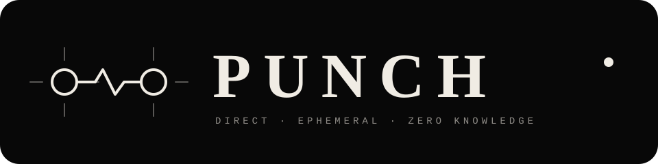

  

# Dependency baseline

`core/Cargo.lock` is the authoritative, tested dependency graph for Punch. Builds and CI should use Cargo's `--locked` flag; do not broadly regenerate the lockfile or run `cargo update` as part of unrelated work.

The v0.10.0 baseline resolves `iroh` 0.96.1, which in turn resolves `ed25519-dalek` 3.0.0-pre.1 and `ed25519` 3.0.0-rc.0. No `[patch]` entry for `ed25519` exists or is needed for this graph.

Git history confirms that commit `0dd70a5` (“pin pre-release crypto dependencies to fix iroh build”) committed the lockfile and changed CI to build with `--locked`; it did not add an `ed25519 = "=2.2.2"` manifest patch. Keep the committed graph unless a locked build demonstrates an incompatibility.
